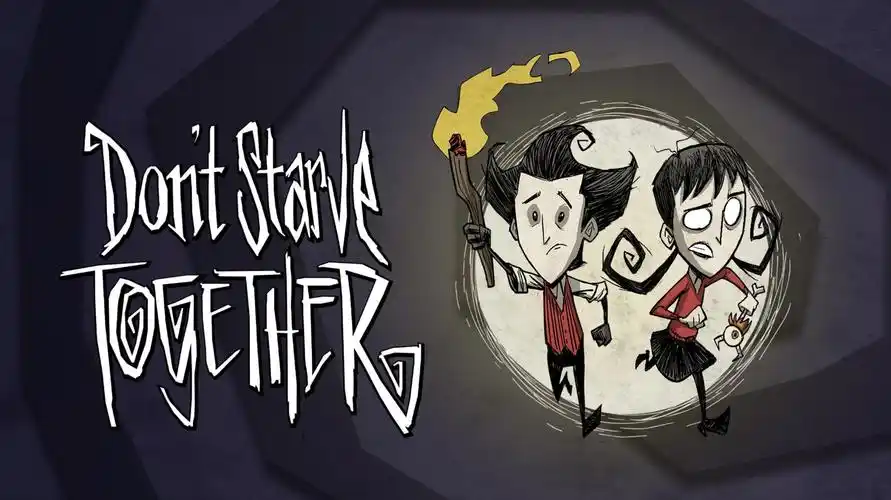

# [BBS]一键饥荒联机版专用服务器搭建脚本


一个支持一键搭建饥荒联机版搭建专用服务器的脚本


[](https://github.com/DongyangHu/bbs-dontstarve-server/releases)
[](https://somsubhra.github.io/github-release-stats/?username=DongyangHu&repository=bbs-dontstarve-server)


## 简介
使用`Shell`编写，提供饥荒联机版专用服务器管理能力，主要功能如下：
- 安装/更新/卸载服务器
- 启动/重启/关闭服务器
- 服务配置管理
- MOD管理
- 特殊名单管理
- 服务器状态查看
  


## 适用范围
- 仅适配Ubuntu系统


## 快速使用
### 一键启动
从 [Release](https://github.com/DongyangHu/bbs-dontstarve-server/releases) 下载脚本`bbs-dontstarve-server-{version}.tar.gz`版本, 解压后运行即可
如下为一键下载启动脚本:
```
curl -L https://github.com/DongyangHu/bbs-dontstarve-server/releases/download/v1.0.0/bbs-dontstarve-server-1.0.0.tar.gz | tar -xz && bash bbs-dontstarve-server/bbs_beautiful.sh

```
后续使用，只需要运行`./bbs_beautiful.sh`即可

### 权限控制
如果需要控制权限，请使用`bbs-dontstarve-server-pure-{version}.tar.gz`版本, 该版本拆分了`依赖安装`和`服务器管理`
从 [Release](https://github.com/DongyangHu/bbs-dontstarve-server/releases) 下载脚本`bbs-dontstarve-server-pure-{version}.tar.gz`版本, 解压后运行`prepare_libs.sh`安装依赖, 需要`root`用户或者具有`sudo`权限的用户, 而后运行`bbs_beautiful_pure.sh`
如下为下载启动脚本:
```
# 下载并解压
curl -L https://github.com/DongyangHu/bbs-dontstarve-server/releases/download/v1.0.0/bbs-dontstarve-server-pure-1.0.0.tar.gz -o bbs-dontstarve-server-pure.tar.gz
tar -xzf bbs-dontstarve-server-pure.tar.gz

# 进入解压后的目录
cd bbs-dontstarve-server-pure

# 用*root*用户, 或者具有`sudo`权限的用户执行依赖准备脚本
sudo bash prepare_libs.sh

# 切换到普通用户, 用普通用户执行主脚本
sudo -u {你的用户} bash bbs_beautiful_pure.sh

```
后续使用，只需要运行`./bbs_beautiful_pure.sh`即可

## 📥 国内下载加速（解决 GitHub 连接慢的问题）

如果你因为众所周知的原因下载失败，推荐使用以下加速地址：
- [ghproxy 加速](https://ghfast.top/https://github.com/DongyangHu/bbs-dontstarve-server/releases/download/v1.0.0/bbs-dontstarve-server-1.0.0.tar.gz)

## LICENSE
[LICENSE](LICENSE)
